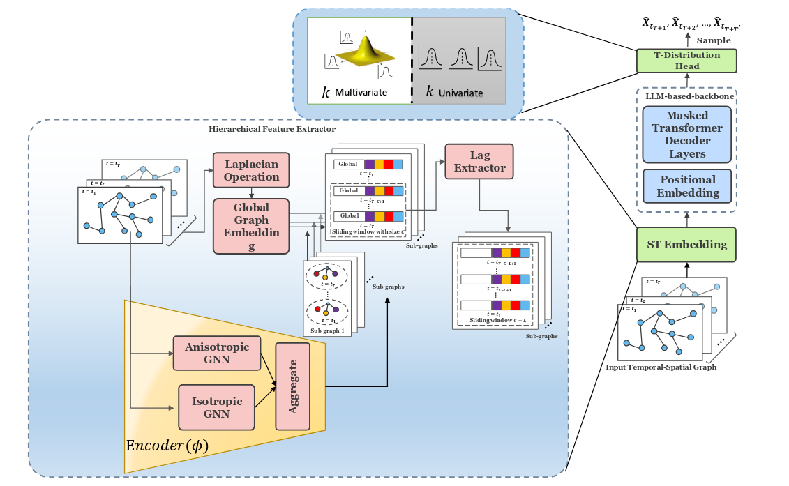

# GITS-LLM: An Efficient Graph LLM for Traffic Prediction


**Official implementation of "GITS-LLM: An Efficient Graph LLM for traffic prediction"**


## Abstract

Traffic forecasting is pivotal for intelligent transportation systems, where accurate and interpretable predictions can significantly enhance operational efficiency and safety. We introduce **GITS-LLM**, a novel multivariate probabilistic forecasting LLM that explicitly models both temporal and spatial traffic patterns. By incorporating proximal traffic information as covariates, GITS-LLM more effectively captures local variations and outperforms existing prompt-based LLMs. Our lightweight distribution-derived strategy enables parameter-efficient domain adaptation under few-shot constraints.

**Key Results:**
- 🚀 **17% improvement** in RMSE for long-term forecasting
- ⚡ **16% more efficient** than existing methods
- 🎯 **Robust performance** across different LLM backbones
- 🔄 **Effective domain adaptation** with minimal parameters

## Architecture Overview



GITS-LLM consists of three main components:

1. **Hierarchical Feature Extractor (HFE)**: Multi-scale sub-graph extraction with global graph embeddings
2. **LLM-based Backbone**: Mistral-inspired decoder-only transformer with RMSNorm and RoPE
3. **T-Distribution Head**: Probabilistic forecasting with learnable parameters

### Novel Contributions

- **🔬 Graph-Aware LLM**: First non-prompt-based probabilistic LLM for traffic forecasting
- **🧠 MoE GNN Encoder**: Combines isotropic and anisotropic experts for robust spatial modeling
- **⚙️ LoRA Domain Adaptation**: Lightweight adaptation using low-rank matrix decomposition
- **📊 Probabilistic Modeling**: T-distribution head for uncertainty quantification

## Installation

### Requirements

- Python >= 3.10
- PyTorch >= 2.3.0
- CUDA >= 11.3 (for GPU acceleration)

### Setup

```bash
# Clone the repository
git clone https://github.com/anonymous/gits-llm.git
cd gits-llm

# Create conda environment
conda create -n gits-llm python=3.8
conda activate gits-llm

# Install dependencies
pip install -r requirements.txt

# Install package in development mode
pip install -e .
```

### Dependencies

```
torch>=1.12.0
torch-geometric>=2.1.0
transformers>=4.21.0
numpy>=1.21.0
scipy>=1.7.0
pandas>=1.3.0
scikit-learn>=1.0.0
matplotlib>=3.5.0
seaborn>=0.11.0
tqdm>=4.62.0
```

## Quick Start

### Basic Usage

```python
from lag_llama.gluon.estimator import LagLlamaEstimator
import torch


# Initialize model
estimator = LagLlamaEstimator(
    ckpt_path=None,
    prediction_length=12,
    context_length=48 * 2,
    # estimator args
    input_size=estimator_args["input_size"],
    n_layer=estimator_args["n_layer"] * 4,
    n_embd_per_head=estimator_args["n_embd_per_head"],
    n_head=estimator_args["n_head"] * 2,
    scaling=estimator_args["scaling"],
    time_feat=estimator_args["time_feat"],
    num_batches_per_epoch=350,
    trainer_kwargs={
        "max_epochs": 150,
    },
    use_feat_dynamic_real=True,
    mistral=True,
    alpha=0.9,
)


# Training
model.fit(data['train'], epochs=150, batch_size=32)

# Prediction
predictions = model.predict(data['test'])
```

### Domain Adaptation

see test_crowd.py


## Datasets

### Supported Datasets

| Dataset | Type | Nodes | Region | Time Steps | Usage |
|---------|------|-------|--------|------------|-------|
| **PeMS03** | Traffic Speed | 170 | California | 26,208 | Pre-training |
| **PeMS04** | Traffic Speed | 307 | California | 16,992 | Pre-training |
| **PeMS07** | Traffic Speed | 883 | California | 26,208 | Pre-training |
| **PeMS08** | Traffic Flow | 170 | California | 17,856 | Pre-training |
| **METR-LA** | Traffic Speed | 207 | California | 34,272 | Few-shot |
| **PEMS-Bay** | Traffic Speed | 325 | California | 52,116 | Few-shot |
| **Brussels** | Traffic Count | 207 | Brussels | 12,672 | Zero-shot |
| **Crowd** | Pedestrian Count | 320 | Nanjing | 9,420 | Zero-shot |


### Hyperparameters

Key hyperparameters used in experiments:

```yaml
model:
  hidden_dim: 256
  num_layers: 6
  num_heads: 8
  context_length: 96
  rank: 8  # LoRA rank

training:
  learning_rate: 0.001
  batch_size: 32
  epochs: 150
  weight_decay: 1e-8
  optimizer: Adam

data:
  prediction_horizons: [15, 30, 60]  # minutes
  normalization: standard
  train_ratio: 0.7
  val_ratio: 0.1
  test_ratio: 0.2
```

## Results

### Main Results

#### Short-term Forecasting (METR-LA)

| Method | 15 min | 30 min | 60 min |
|--------|--------|--------|--------|
| | MAE↓ / RMSE↓ | MAE↓ / RMSE↓ | MAE↓ / RMSE↓ |
| GMAN | 2.80 / 5.55 | 3.12 / 6.49 | 3.44 / 7.35 |
| STEP | 2.61 / 4.98 | 2.96 / 5.97 | 3.37 / 6.99 |
| FlashST | 2.84 / 5.57 | 3.19 / 6.43 | 3.60 / 7.44 |
| UniST | 2.89 / 5.63 | 3.26 / 6.51 | 3.65 / 7.52 |
| **GITS-LLM** | **2.65 / 5.01** | **2.97 / 5.84** | **3.35 / 6.73** |

#### Long-term Forecasting (PEMS07-M)

| Method | 90 min | 120 min | 150 min |
|--------|--------|---------|---------|
| | MAE↓ / RMSE↓ | MAE↓ / RMSE↓ | MAE↓ / RMSE↓ |
| FlashST | 4.21 / 6.98 | 4.51 / 7.20 | 4.83 / 7.54 |
| UniST | 3.98 / 6.71 | 4.09 / 6.66 | 4.34 / 7.47 |
| **GITS-LLM** | **3.84 / 6.02** | **4.04 / 6.51** | **4.19 / 7.01** |

### Performance Analysis

- **Spatial Dependencies**: MoE GNN encoder captures both global and local patterns
- **Temporal Modeling**: RoPE-enhanced attention handles long sequences efficiently  
- **Uncertainty Quantification**: T-distribution provides calibrated confidence intervals
- **Domain Transfer**: LoRA achieves effective adaptation with <2% trainable parameters

## Ablation Studies

### Component Analysis

| Component | MAE↓ | RMSE↓ | MAPE(%)↓ |
|-----------|------|-------|----------|
| Full Model | **2.60** | **4.86** | **6.51** |
| w/o Global Embedding | 2.81 | 5.63 | 6.81 |
| w/o MoE Encoder | 2.69 | 5.37 | 6.73 |
| Univariate Distribution | 2.81 | 5.63 | 6.81 |

### Scalability Analysis

| K-hop | MAE↓ | RMSE↓ | MAPE(%)↓ |
|-------|------|-------|----------|
| 1-hop | 2.96 | 5.34 | 7.35 |
| 3-hop | **2.60** | **4.86** | **6.51** |
| 5-hop | 2.63 | 4.89 | 6.54 |

## Citation

If you find this work useful, please cite:

```bibtex
@inproceedings{anonymous2025gits,
  title={GITS-LLM: An Efficient Graph LLM for traffic prediction},
  author={Anonymous},
  booktitle={Temporal Graph Learning Workshop, KDD 2025},
  year={2025}
}
```

---

**Keywords**: Traffic Prediction, Graph Neural Networks, Large Language Models, Spatio-temporal Learning, Domain Adaptation
